## NSX-T documentation

* BEFORE you start - Set MTU - 1700 or 9000 on the distributed switch on vCenter > Network section
* Download the NSX-T Manager from VMWare portal
* Ensure the ESXi hosts are upgraded to the 6.7 U3 (use upgrade manager to upgrade the hosts)
* Create a distributed switch `dvSwitch` and assign the `vmnic1` (Use vcenter-terraform for HOMELAB) for all the hosts that are part of this switch

  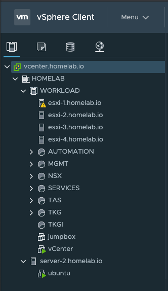

  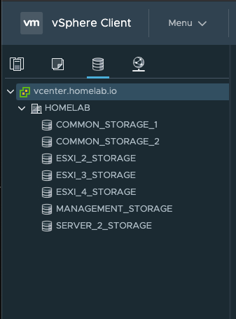

  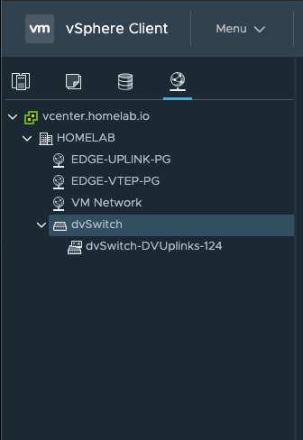

* Import the NSX-T manager using govc (Use ../deploy-nsx/govc-deploy)
  - Create a file `govc-env` and paste the following contents into it
  ```
  export GOVC_INSECURE=1
  export GOVC_URL=vcenter.homelab.io
  export GOVC_USERNAME=automation@homelab.io
  export GOVC_PASSWORD=VMware1!
  export GOVC_DATACENTER=HOMELAB
  export GOVC_DATASTORE=COMMON_STORAGE
  export GOVC_NETWORK="VM Network"
  export GOVC_RESOURCE_POOL=/HOMELAB/host/MANAGEMENT/Resources/NSX_RP
  export GOVC_HOST=esxi-1.homelab.io
  ```
  - Create a file called `nsx-appliance.json` with the following contents
  ```
  {
    "Deployment": "medium",
    "DiskProvisioning": "flat",
    "IPAllocationPolicy": "dhcpPolicy",
    "IPProtocol": "IPv4",
    "PropertyMapping": [
      {
        "Key": "nsx_passwd_0",
        "Value": "VMware1!"
      },
      {
        "Key": "nsx_cli_passwd_0",
        "Value": "VMware1!"
      },
      {
        "Key": "nsx_cli_audit_passwd_0",
        "Value": "VMware1!"
      },
      {
        "Key": "nsx_cli_username",
        "Value": "admin"
      },
      {
        "Key": "nsx_cli_audit_username",
        "Value": "audit"
      },
      {
        "Key": "extraPara",
        "Value": ""
      },
      {
        "Key": "nsx_hostname",
        "Value": "nsx.homelab.io"
      },
      {
        "Key": "nsx_role",
        "Value": "NSX Manager"
      },
      {
        "Key": "nsx_gateway_0",
        "Value": "172.16.0.1"
      },
      {
        "Key": "nsx_ip_0",
        "Value": "172.16.0.61"
      },
      {
        "Key": "nsx_netmask_0",
        "Value": "255.255.254.0"
      },
      {
        "Key": "nsx_dns1_0",
        "Value": "172.16.0.30,172.16.0.31"
      },
      {
        "Key": "nsx_domain_0",
        "Value": ""
      },
      {
        "Key": "nsx_ntp_0",
        "Value": "ntp.homelab.io"
      },
      {
        "Key": "nsx_isSSHEnabled",
        "Value": "True"
      },
      {
        "Key": "nsx_allowSSHRootLogin",
        "Value": "True"
      },
      {
        "Key": "mpIp",
        "Value": ""
      },
      {
        "Key": "mpToken",
        "Value": ""
      },
      {
        "Key": "mpThumbprint",
        "Value": ""
      },
      {
        "Key": "mpNodeId",
        "Value": ""
      },
      {
        "Key": "mpClusterId",
        "Value": ""
      }
    ],
    "NetworkMapping": [
      {
        "Name": "Network 1",
        "Network": "VM Network"
      }
    ],
    "MarkAsTemplate": false,
    "PowerOn": true,
    "InjectOvfEnv": false,
    "WaitForIP": false,
    "Name": "nsx-manager"
  }
  ```
  - Source the `govc-env` file and then execute `govc import.ova -options=nsx-appliance.json nsx-unified-appliance-3.0.2.0.0.16887203.ova`

* Once the NSX manager is up and running, navigate to the nsx manager console and login

* Generate a CSR and self signed certificate, navigate to System > Certificates

* Update the nsx manager certificate using the `curl` command
  - `curl -u "admin:VMware1!" -X POST --insecure "https://nsx.homelab.io/api/v1/node/services/http?action=apply_certificate&certificate_id=52bba154-3803-4e8e-b732-6a8c191a370b"`

* Add the nsx manager license

* Update the Gloabl MTU on NSX-Manager to `9000`, System > Fabric > Settings

  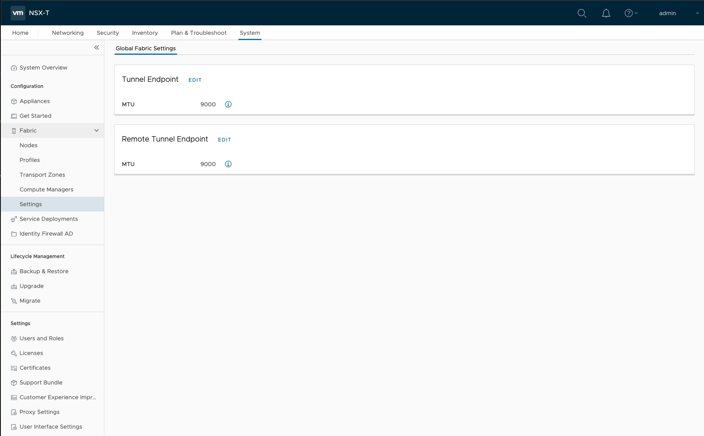

* Register compute manager

  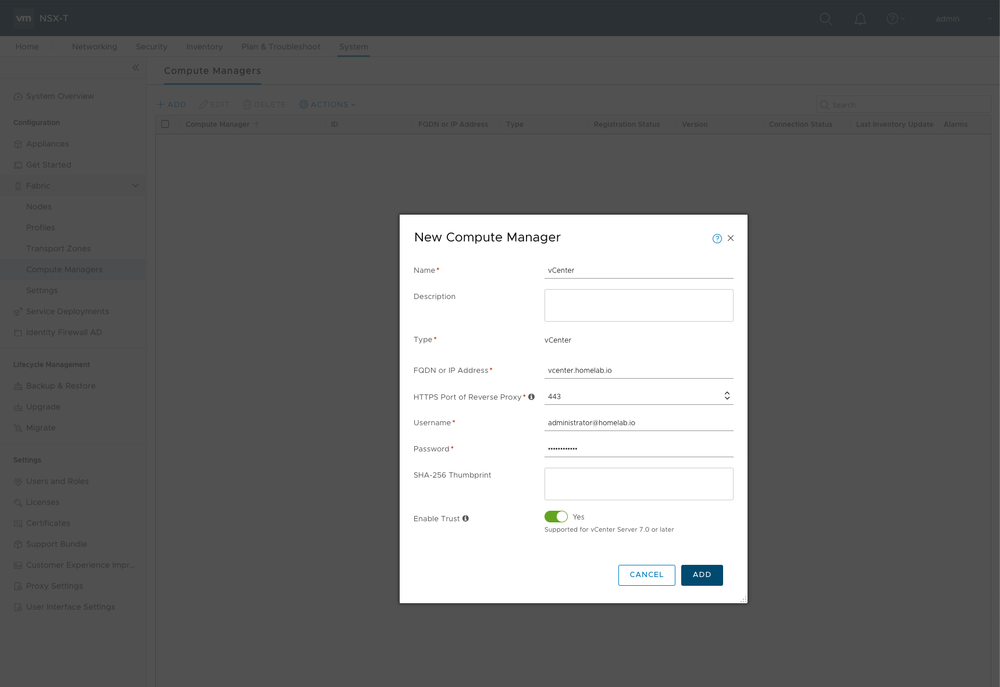

* In NSX-T 3.x, NSX Manager and NSX controller are bundled together

* Create 2 transport zones
  | NAME | SWITCH |
  | - | - |
  | `switch-overlay` | `switch-overlay` |
  | `switch-vlan` | `switch-vlan` |

  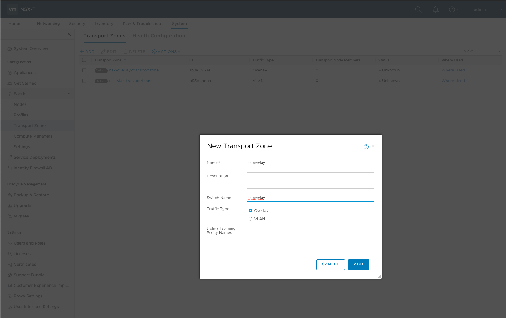

  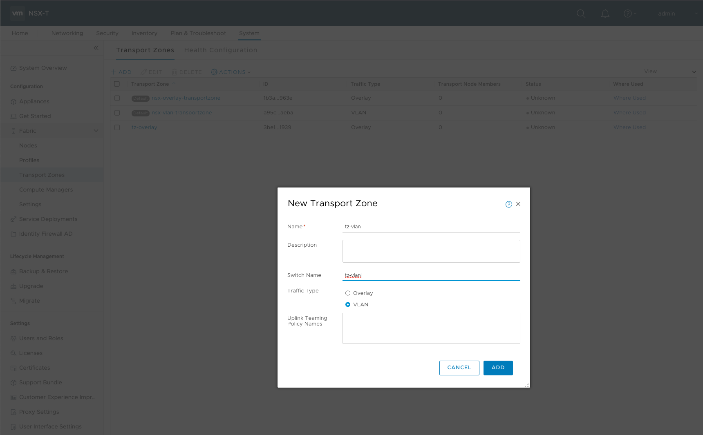

* Create a Profile
  - Name: `nsx-esxi-uplink-hostswitch-profile`
  - Teamings Name: `Default Teaming` | Active Uplinks: `uplinks-1`
  - Transport VLAN: `3000`
  - MTU: `BLANK`

  

* Create a `TEP-IP-POOL` by going to Networking > IP Address Pools > IP Address Pools
    - `TEP-IP-POOL` | `172.16.100.1-172.16.100.254` | `172.16.100.0/24` (CIDR)

  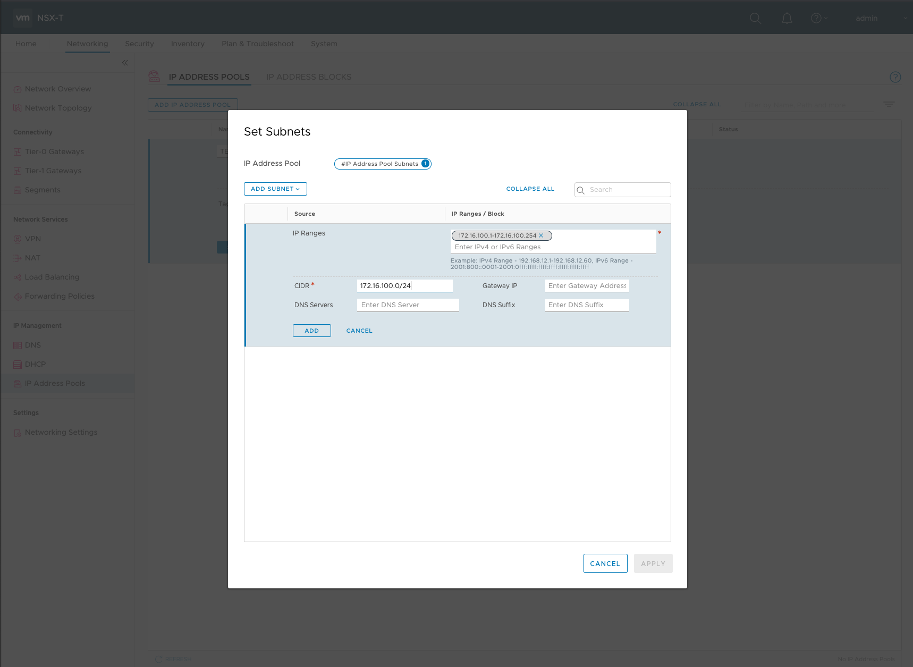

  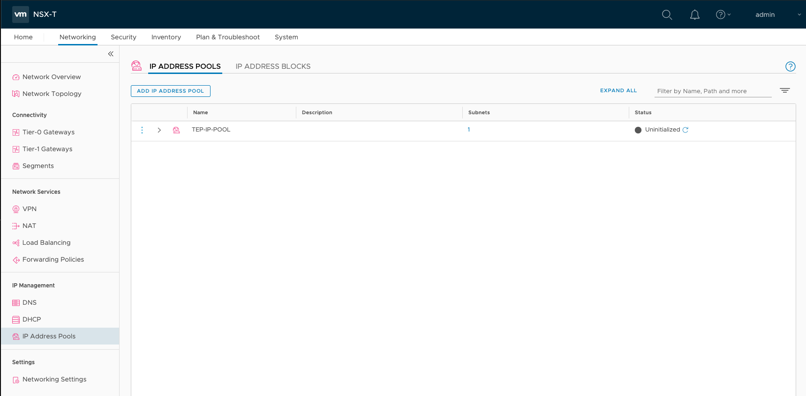

* Create the Load Balancer Active Monitors, Networking > Load Balancing > Monitors > Add Active Monitors

  | TYPE | NAME | MONITORING PORT |
  | -- | -- | -- |
  | `TCP` | `ROUTERS` | 8080 |
  | `TCP` | `DIEGO_BRAINS` | 2222 |
  | `TCP` | `ISTIO_ROUTERS` | 8080 |
  | `TCP` | `TKGI_API` | 9021 |

  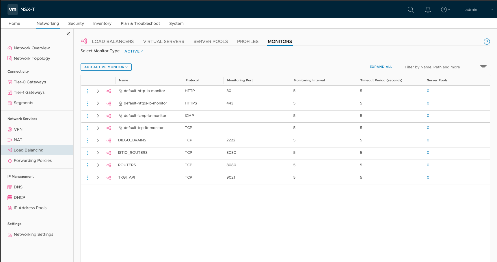

* Create the Transport Node Profile by clicking on Fabric > Profiles > Transport Node Profiles
  - Name: `host-transport-node-profile`
  - Type `N-VDS`
  - Mode: Standard
  - Name: `switch-overlay`
  - Transport Zone: `switch-overlay`
  - Uplink Profile: `nsx-esxi-uplink-hostswitch-profile`
  - IP Assignment: `Use IP Pool`
  - IP Pool: `TEP-IP-POOL`
  - Uplinks: `uplink-1 (active): vmnic1`

**OR**

* Create the Transport Node Profile by clicking on Fabric > Profiles > Transport Node Profiles
  - Name: `host-transport-node-profile`
  - Type `VDS`
  - Name: `vCenter` `dvSwitch`
  - Transport Zone: `switch-overlay` `switch-vlan`
  - Uplink Profile: `nsx-esxi-uplink-hostswitch-profile`
  - IP Assignment: `Use IP Pool`
  - IP Pool: `TEP-IP-POOL`
  - Uplinks: `uplink-1 (active): uplink1`

  

  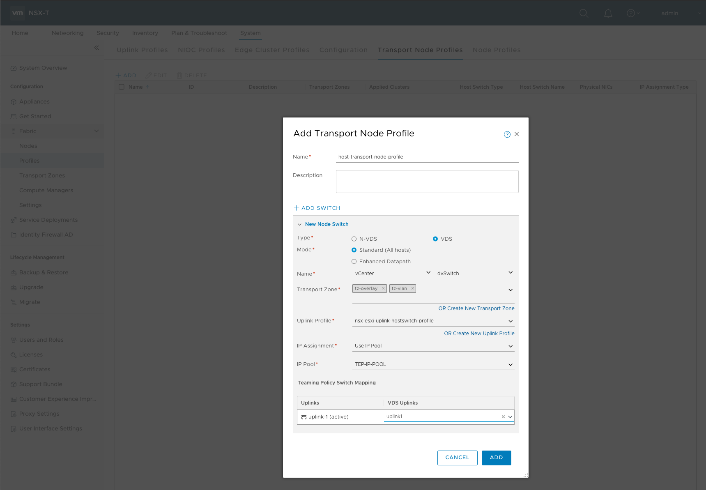

  

* Click on System > Fabric > Nodes > Edge Transport Nodes > Add Edge VM
  * Create the edge node, of `large` form factor. Load balancers need minimum of `large` edge node
   - Name it `nsx-edge` with the hostname `nsx-edge.homelab.io`
   - Use password `VMware1!`
   - Allow SSH Login & Allow Root SSH Login - `true`
   - Compute Manager: `vCenter`
   - Cluster: `WORKLOAD`
   - Resource Pool: `NSX`
   - Datastore: `MANAGEMENT_STORAGE`
   - Assign a static IP to the edge `172.16.0.62/22` and gateway is `172.16.0.1`
   - Select the network as `VM Network` for all the 4 interfaces

   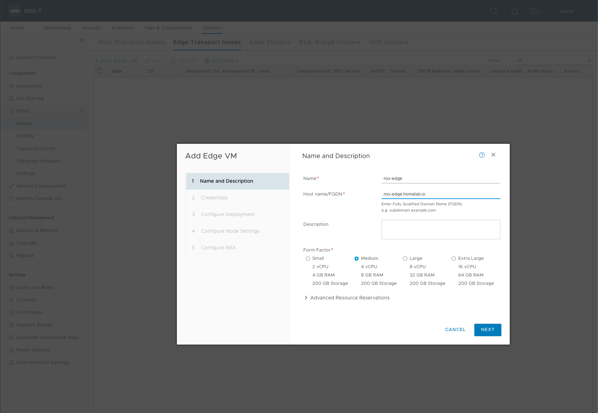

   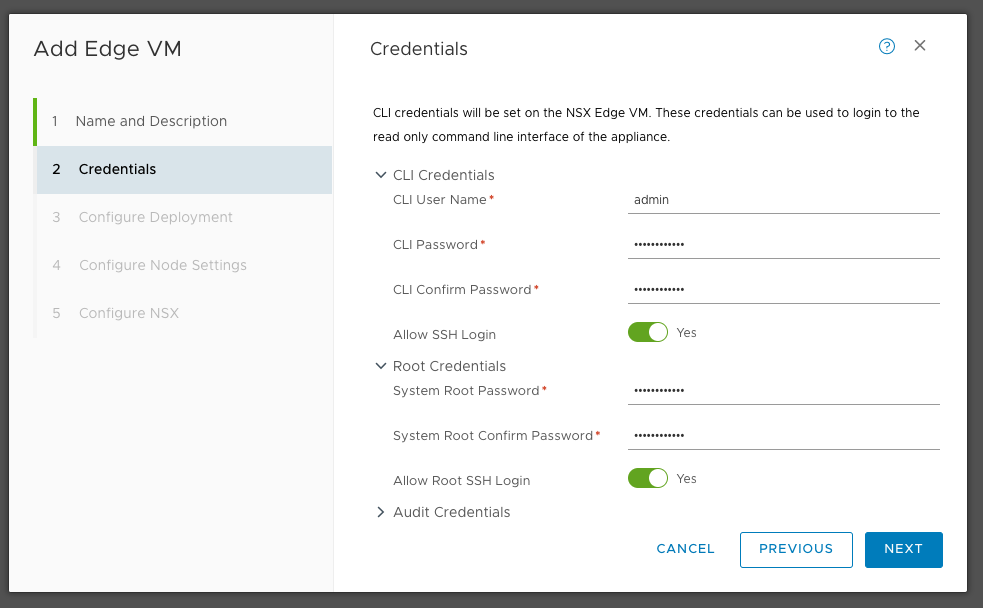

   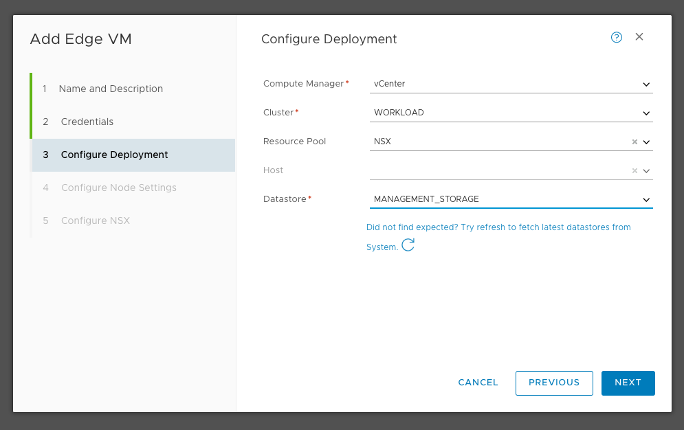

   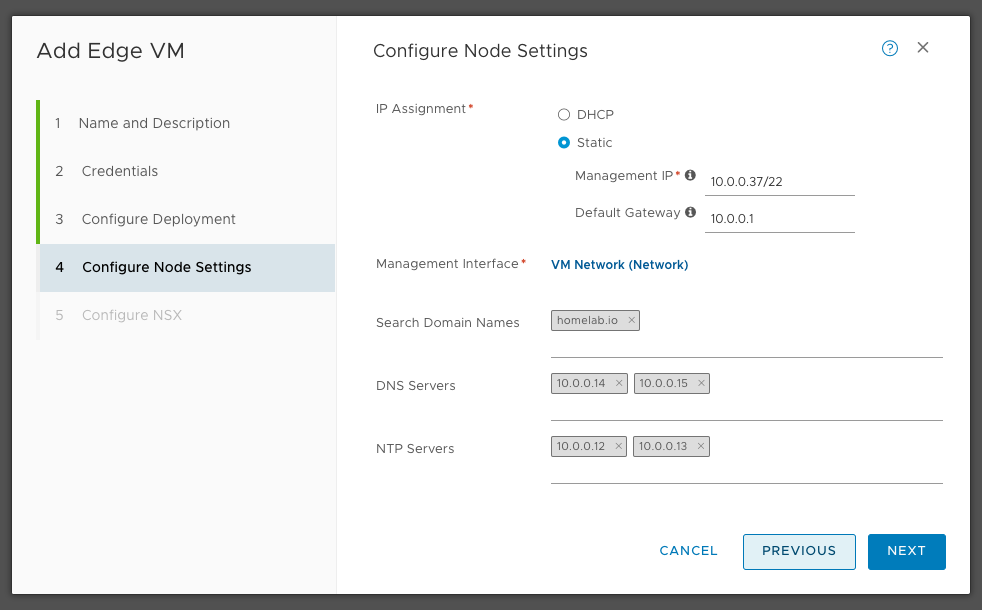

  * Assign the overlay transport zone (East-West)
    - Edge Switch Name: `switch-overlay`
    - Transport Zone: `switch-overlay`
    - Uplink Profile: `nsx-edge-single-nic-uplink-profile`
    - IP Assignment: `Use IP Pool`
    - IP Pool: `TEP-IP-POOL`
    - Uplinks: `uplink-1 (active)` | Virtual NICs: `fp-eth0` | `EDGE-VTEP-PG`
    - Physical NICs: `vmnic1` - `uplink-1`
   
  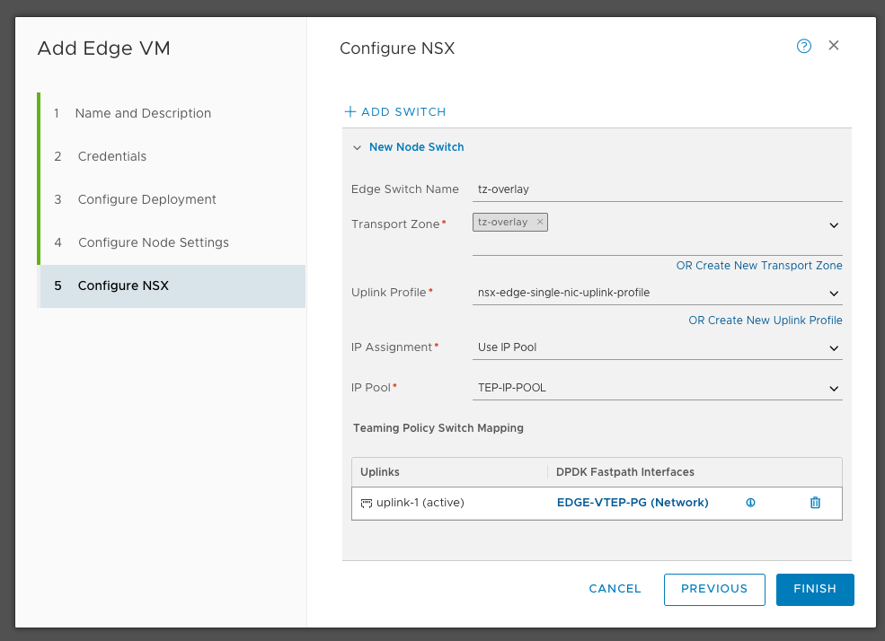

  * Assign the vlan transport zone (North-South)
    - Edge Switch Name: `switch-vlan`
    - Transport Zone: `switch-vlan`
    - Uplink Profile: `nsx-edge-single-nic-uplink-profile`
    - Uplinks: `uplink-1 (active)` | Virtual NICs: `fp-eth1` | `EDGE-UPLINK-PG`
    - Physical NICs: `vmnic1` - `uplink-1`

  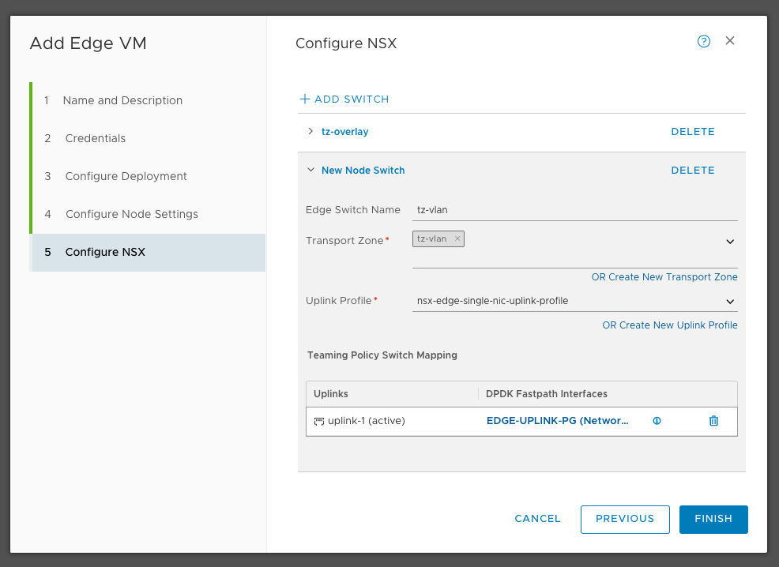

  

* Create a new edge cluster `edge-cluster`

  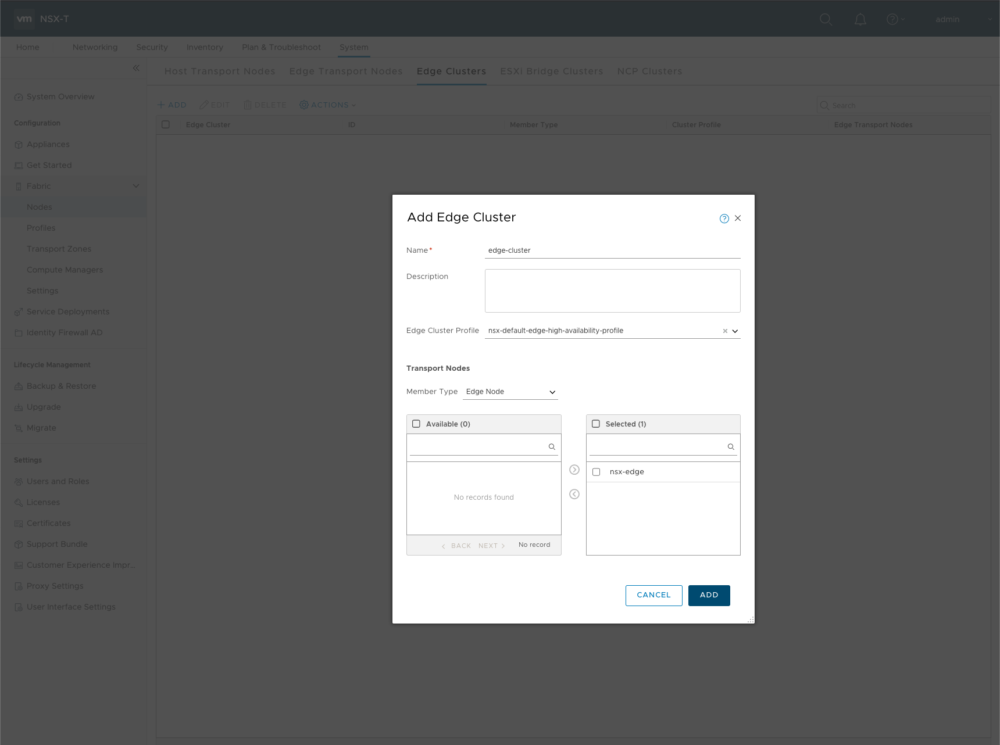

* Click on System > Fabric > Nodes > Host Transport Nodes > vCenter > WORKLOAD
  * `Configure NSX` and select the `host-transport-node-profile`

  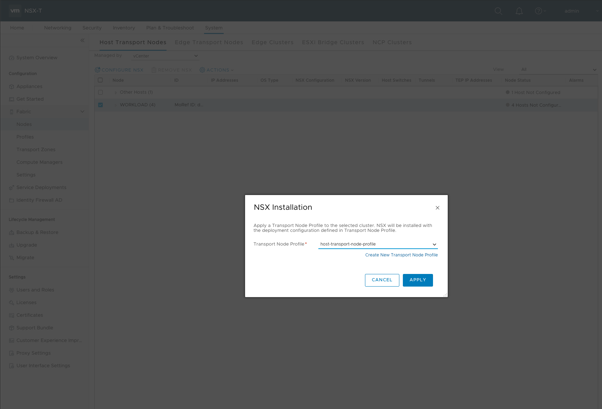

  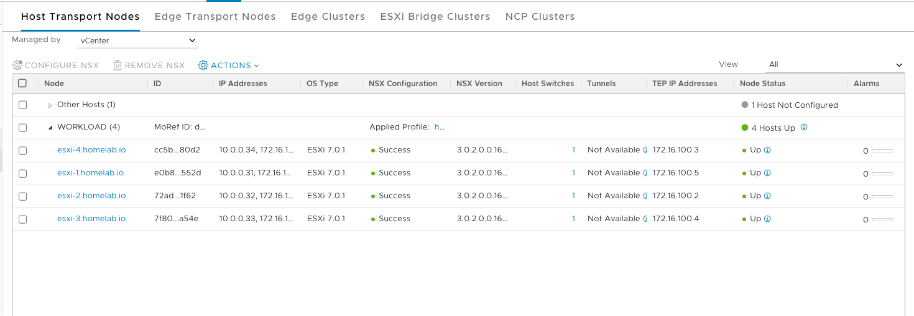

* Final view of vSphere Network after terraform

  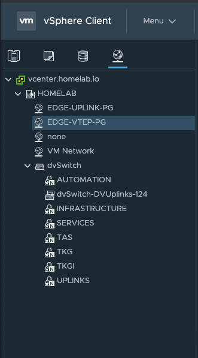
----
**NOTE: choose `vmnic1` as `vmnic0` is already assigned to the distributed switch `common_dvPortGroup`**

**Validate this setting on `nsx-edge` before moving on**

| N-VDS Type | Uplink Profile | IP Allocation | Virtual Nics |
| - | - | - | - |
| `nsx-overlay-transportzone` | nsx-edge-single-nic-uplink-profile | Use IP Pool (TEP-IP-POOL) | fp-eth0 |
| `nsx-vlan-transportzone` | nsx-edge-single-nic-uplink-profile | - | fp-eth1 |
----


#### BELOW THIS IS ALL TERRAFORMED ####

* Create Tier-0 Gateway by clicking on Networking > Tier-0 Gateway > Add Gateway
  - Name: `ROUTER-T0`
  - HA Mode: `Active Standby`
  - Edge Cluster: `edge-cluster`
  - Failover Mode: `Non-Preemptive`

* Create Tier-1 Gateway by clicking on Networking > Tier-1 Gateway > Add TIER-1 Gateway `INFRASTRUCTURE-T1` and enable Router-Advertisement for:
  - All Static Routes
  - All Connected Segments & Service Ports
  - All LB VIP Routes

* Create Tier-1 Gateway by clicking on Networking > Tier-1 Gateway > Add TIER-1 Gateway `DEPLOYMENT-T1` and enable Router-Advertisement for:
  - All Static Routes
  - All Connected Segments & Service Ports
  - All LB VIP Routes

* Create Tier-1 Gateway by clicking on Networking > Tier-1 Gateway > Add TIER-1 Gateway `SERVICES-T1` and enable Router-Advertisement for:
  - All Static Routes
  - All Connected Segments & Service Ports
  - All LB VIP Routes

* Create Segments (logical switches), Networking > Segments

| Name | Uplink & Type | Subnet | Transport Zone | VLAN |
| - | - | - | - | - |
| INFRASTRUCTURE | `INFRASTRUCTURE-T1` | `192.168.10.1/26` | `switch-overlay` | - |
| DEPLOYMENT | `DEPLOYMENT-T1` | `192.168.12.1/23` | `switch-overlay` | - |
| SERVICES | `SERVICES-T1` | `192.168.14.1/23` | `switch-overlay` | - |
| UPLINKS | - | - | `switch-vlan` | 0 |


* Select the `ROUTER-T0` and then Edit > Interfaces > External and Service Interfaces > Configuration > Router Ports > Add
  - Name: `UPLINK-TO-PYHSICAL`
  - MTU: `1600`
  - Transport Node: `edge-tn`
  - Logical Switch: `UPLINKS`
  - Logical Switch Port: `Attach to new switch port`
  - IP Address/mask: `172.16.0.28/23`

* Select the `ROUTER-T0` and then click Edit > Routing > Static Routes > Add
  - Network: `0.0.0.0/0`
  - Next Hop: `172.16.0.1`
  - Distance: `1`

* Configuring NAT rules, select the Gateway `ROUTER-T0` and then click  Add NAT Rule

| Rule Type | Source | Destination | Applied To |
| --- | --- | --- | --- |
| SNAT | 192.168.0.0/16 | 172.16.0.29 | UPLINK-TO-PYHSICAL |
| DNAT | 172.16.0.30 | 192.168.10.9 (For testing only) | UPLINK-TO-PYHSICAL |

* Create a load balancer, Networking > Load Balancing > Add
    - `pcf-lb` | `small`
    - Attach the load balancer to the T1 router `INFRASTRUCTURE-T1`
    - Create Server Pools and Virtual Servers

| Virtual Server Name | IP | Port | Server Pool Name | Server Pool Monitoring |
| - | - | - | - | - |
| OpsManagerVirtualServer | 172.16.0.30 | 22-8443 | OpsManagerServerPool | TCP port 443 |
| RoutersVirtualServer | 172.16.0.31 | 443 | RouterServerPool | TCP port 443 |
| DiegoBrainsVirtualServer | 172.16.0.32 | 2222 | DiegoBrainServerPool | TCP port 2222 |

    - Attach the load balancer to the Virtual Servers

* Create a New IP Pool for `Orgs`, those are created upon PAS deployment. Navigate to Networking > IPAM and click Add > `pcf-ip-block` - `192.168.32.0/19`

* Create a external SNAT IP Pool for the external networking. Go to Groups > IP Pools > Add
  - `pcf-floating-ip-pool` | `172.16.0.50 - 172.16.0.70` | `172.16.0.0/23` (CIDR)

**NOTE: On the edgerouter X, define a static routing for 172.16.30.0/24 to route to 172.16.0.31 (NSX-T edge router IP). `172.16.30.0/24` is a transient network used to relay traffic from one edge router to another**